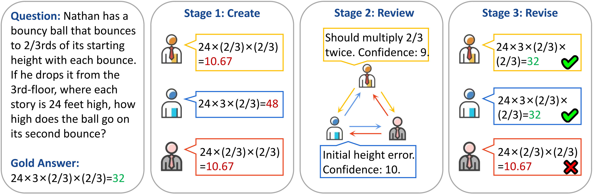

# Towards Reasoning in Large Language Models via Multi-Agent Peer Review Collaboration

<div align="center">

 [Overview](https://github.com/HITsz-TMG/Multi-agent-peer-review#sparkles-overview) | [News](https://github.com/HITsz-TMG/Multi-agent-peer-review#fire-news) | [Example](https://github.com/HITsz-TMG/Multi-agent-peer-review#rocket-example) | [Usage](https://github.com/HITsz-TMG/Multi-agent-peer-review#rotating_light-usage)

</div>


## :sparkles: Overview

This repository contains official implementation of our paper [Towards Reasoning in Large Language Models via Multi-Agent Peer Review Collaboration](https://arxiv.org/abs/2311.08152).

We introduce a multi-agent collaboration strategy that emulates the academic peer review process. Each agent independently constructs its own solution, provides reviews on the solutions of others, and assigns confidence levels to its reviews. Upon receiving peer reviews, agents revise their initial solutions.

Extensive experiments on three different types of reasoning tasks show that our collaboration approach delivers superior accuracy across all ten datasets compared to existing methods. 

If you have any question, please feel free to contact us by e-mail: xuzhenran.hitsz@gmail.com or submit your issue in the repository.

## :fire: News

[Nov 14, 2023] We release the codes and the results of our method.

## :rocket: Example

<p align="center" width="100%"></p>

## :rotating_light: Usage
    
### Environment

```
conda create -n MAPR python=3.9
conda activate MAPR
pip install -r requirements.txt
```

### Run
Take GSM8K dataset as an example.

#### 1. Peer Review
```
python peer_review.py --task GSM8K --openai_key YOUR_KEY --openai_organization YOUR_ORG
```

#### 2. Debate
```
python debate.py --task GSM8K --openai_key YOUR_KEY --openai_organization YOUR_ORG
```

#### 3. Peer Review w/o Confidence
```
python feedback.py --task GSM8K --openai_key YOUR_KEY --openai_organization YOUR_ORG
```

#### 4. Self-correction
```
python self_correction.py --task GSM8K --openai_key YOUR_KEY --openai_organization YOUR_ORG
```

#### 5. Majority and Zero-shot CoT
```
python single_agent.py --task GSM8K --openai_key YOUR_KEY --openai_organization YOUR_ORG
```

### Evaluate
Take GSM8K dataset as an example.

```
python eval.py --task GSM8K --method peer_review --time_flag 1113
```

