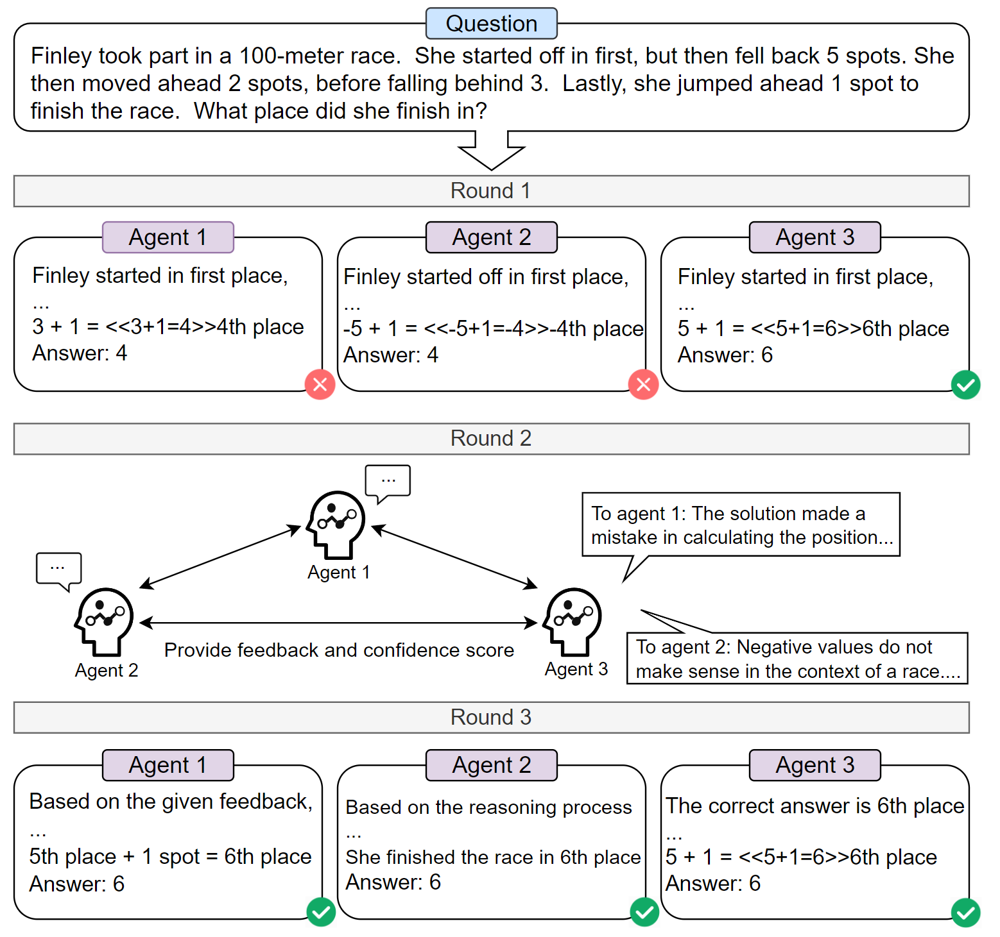
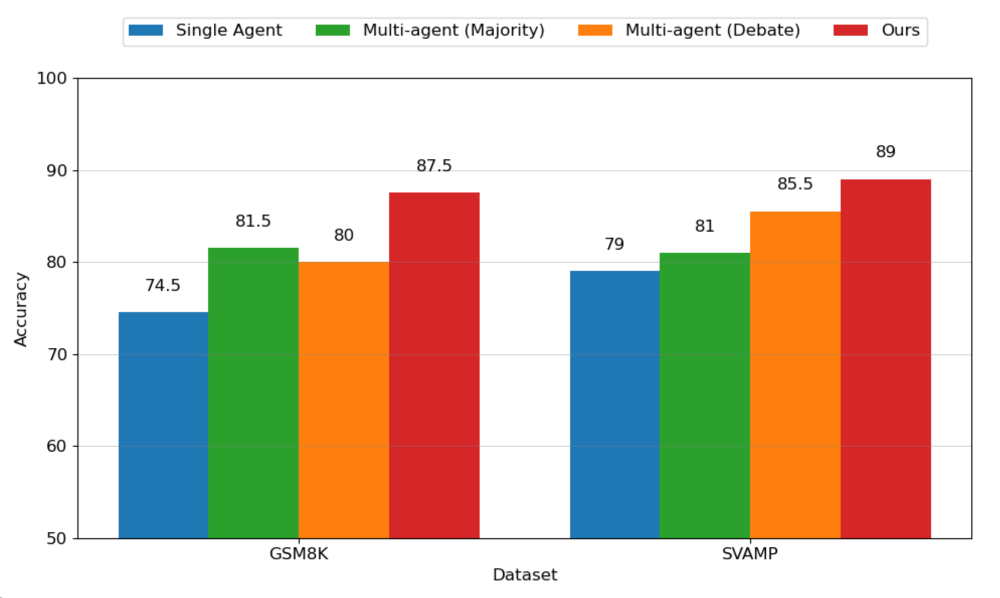

# Multi-agent Peer Review

This repository contains the code implementation for our Multi-agent Peer Review System, and the code and data will be made available soon.

Our approach is illustrated in the figure below:

  
   
  <em>Overview</em>

Here are some experimental results:

  
   
  <em>Experimental Results</em>

If you have any questions, please feel free to contact us (21S051043@stu.hit.edu.cn) or raise an issue on GitHub.

Thank you for your interest in our Multi-Agent Peer Review System.

